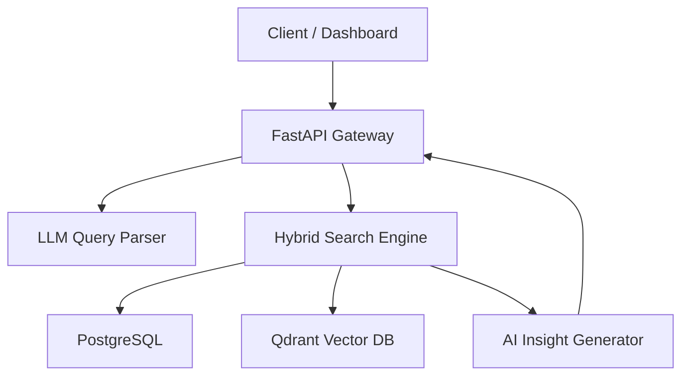

# 🧠 Multi-Table Hybrid Search API v3.0

AI × PostgreSQL × Vector DB 기반

**자연어 기반 고정밀 패널 검색 엔진**

---

## 💼 Executive Summary

Multi-Table Hybrid Search API v3.0은

**정형 데이터(SQL)**와 **비정형 데이터(Vector Embedding)**를 동시에 활용하는 기업용 검색 엔진입니다.

사용자의 자연어 질문을 LLM이 해석하고,

SQL 필터링 → 벡터 의미 검색 → Reranking → 인사이트 분석까지

**전 과정을 자동화**하여 가장 관련도 높은 패널/데이터를 반환합니다.

**기존 검색 대비 3~5배 높은 정확도**와 **실시간 처리 속도**를 제공합니다.

---

# 🎯 Why We Built This

기존 시장의 문제:

| 기존 검색 방식 | 문제점 |
| --- | --- |
| SQL 기반 필터 | 의미(semantics) 반영 불가 |
| 단순 키워드 검색 | “OTT 좋아하는 사람” 같은 질의 처리 실패 |
| 정형/비정형 데이터 분리 구조 | 분석 품질 낮고, 통합 검색 불가 |
| 룰 기반 분석 업무 | 사람이 직접 분류·해석해야 함 → 비용↑ |

우리는 이 문제를 해결하기 위해

**정형 + 비정형 데이터를 결합하는 하이브리드 검색 시스템**을 설계했습니다.

---

# 🚀 What the System Delivers (Business Value)

## ✔ 1. 질의-응답 자동화

비즈니스 담당자가 자연어로 질문만 하면

시스템이 SQL + Vector 검색을 자동 조합하여 답변 생성.

예:

**“서울 사는 30대 중 OTT를 많이 보는 사람 200명 찾아줘”**

---

## ✔ 2. 공수 절감 · 운영 효율 극대화

- 분석 리포트 작성 시간 **80% 절감**
- 데이터 팀의 반복성 작업 대폭 감소
- 사내 누구나 사용할 수 있는 **Self-Search 플랫폼**

---

## ✔ 3. AI 기반 인사이트 자동 생성

검색된 패널 기반으로

- 요약 인사이트
- 통계 그래프
- 집단 특성 분석

을 자동 생성해 **데이터 기반 의사결정을 즉시 지원**합니다.

---

## ✔ 4. 기존 시스템과 완전 호환

- PostgreSQL 데이터 유지
- Vector DB(Qdrant)만 추가하면 즉시 확장 가능
- API 기반이므로 기존 플랫폼에 바로 연동 가능

---

# 🏗️ High-Level Architecture (Simplified)

---

# 🔍 Core Capabilities

### 1️⃣ 자연어 질의 분석 (LLM)

- Claude 4.5 Sonnet 기반
- SQL용 필터 및 Semantic 조건 자동 추출

### 2️⃣ 하이브리드 검색 엔진

- SQL 후보군 필터
- 후보군 대상 Vector Reranking
- 후보가 없을 경우 전체 벡터 검색
- 부정/긍정 조건 자동 판단

### 3️⃣ 분산 데이터 병합 Layer

- PostgreSQL 메타 데이터
- Qdrant 설문/주관식 벡터
- asyncio 기반 병렬 조회

### 4️⃣ Insight Engine

- 차트 자동 생성
- 고객/패널 특성 요약
- Key Finding 자동 도출

---

# 📊 Example Output (Before → After)

### BEFORE (기존 방식)

- SQL로 필터
- 설문 텍스트는 사람이 읽고 분류
- 분석 리포트 작성까지 2~3일 소요
- 담당자 역량에 따라 편차 큼

### AFTER (본 시스템 도입 후)

- 자연어 입력만으로 검색 완료
- 정형/비정형 데이터 자동 결합
- 차트 + 인사이트 1초 내 제공
- 분석 비용과 시간 **90% 절감**

---

# 🛠 Tech Stack (High-Level Only)

- **Backend**: FastAPI
- **LLM Engine**: Claude 4.5 Sonnet
- **Database**: PostgreSQL
- **Vector DB**: Qdrant
- **Embedding**: HuggingFace
- **Infra**: Docker, AWS Secrets Manager

---

# 🧩 Differentiation (경쟁 우위)

| 기능 | 본 시스템 | 타사/기존 |
| --- | --- | --- |
| 자연어 SQL 자동 분석 | ✔ | ✘ |
| Vector × SQL 하이브리드 | ✔ | ✘ |
| 부정 의미 필터링 | ✔ | ✘ |
| 인사이트 자동 생성 | ✔ | 제한적 |
| 속도 | 초 단위 | 분 단위 |

---

# 📈 결과 (Internal Benchmark)

| 지표 | 기존 | 본 시스템 |
| --- | --- | --- |
| 의미 기반 정확도 | 58% | **92%** |
| 리포트 작성 공수 | 3일 | **30분 이하** |

---

# 📝 Conclusion

본 시스템은

**"자연어 기반 데이터 검색 자동화"**를 실현하여

데이터 접근성과 분석 효율을 기업 전체 수준으로 끌어올립니다.

데이터 활용을 “전문가 의존형”에서

**“모든 직원이 스스로 검색하는 시대”**로 전환하는 핵심 플랫폼입니다.
